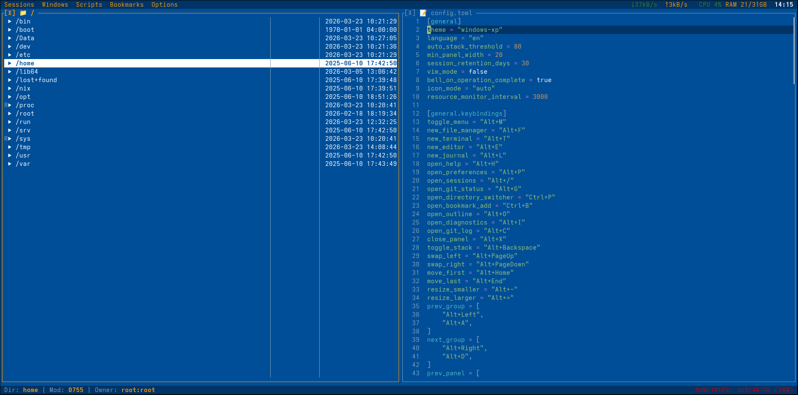
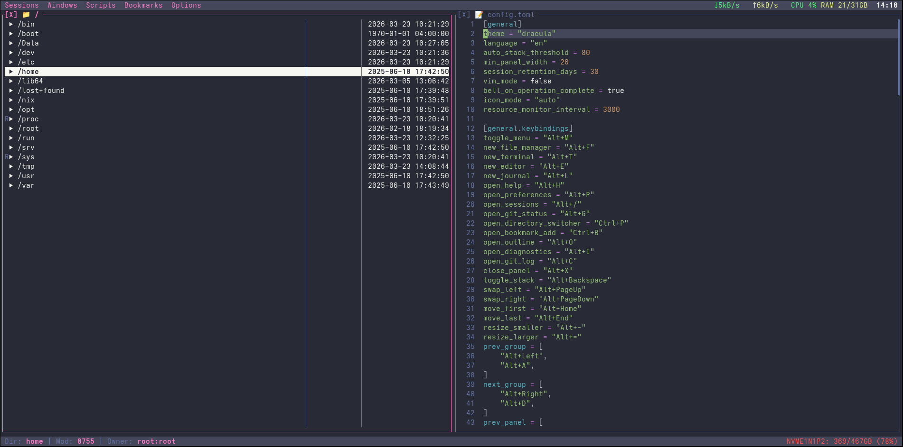
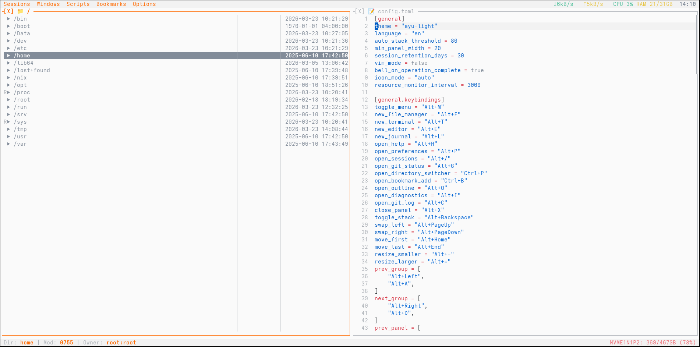
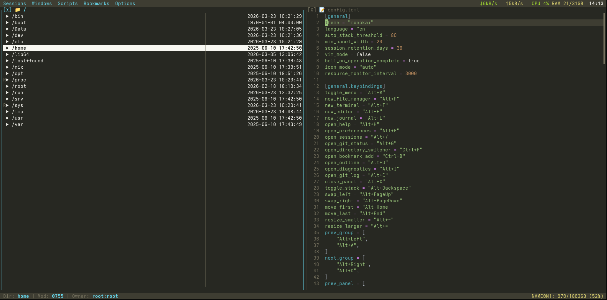
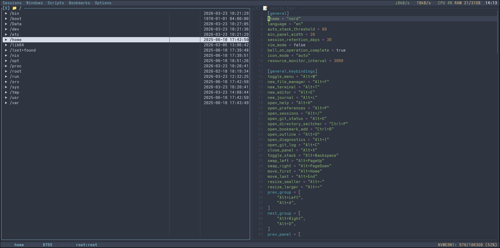
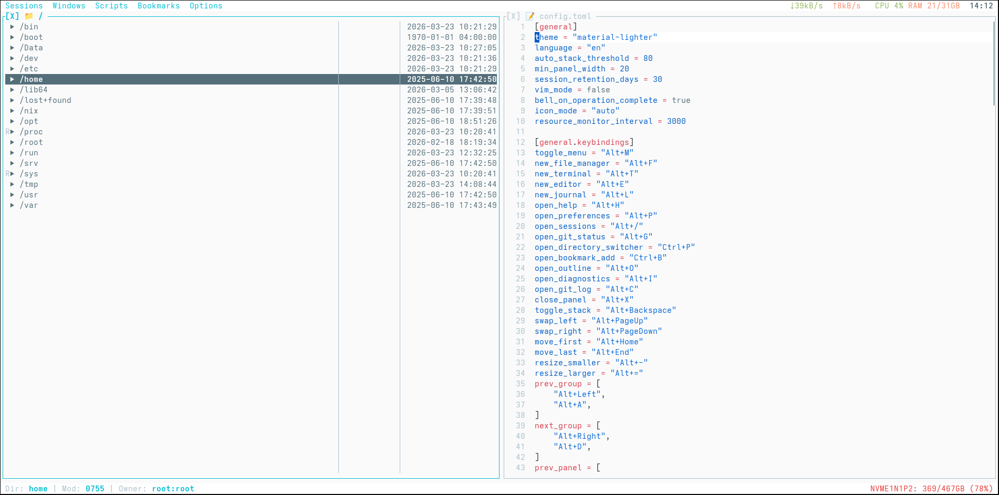

# TermIDE

[](https://github.com/termide/termide/releases)
[](https://github.com/termide/termide/actions)
[](https://opensource.org/licenses/MIT)

A cross-platform terminal-based IDE, file manager, and virtual terminal written in Rust.

**[Website](https://termide.github.io)** | **[Documentation](doc/en/README.md)** | **[Releases](https://github.com/termide/termide/releases)** | **[Screenshots](https://ibb.co/album/nPX6p6)**

## Why TermIDE?

Unlike traditional terminal editors that need extensive plugin configuration, TermIDE works out of the box:

| Feature | TermIDE | Vim/Neovim | Helix | Micro |
|---------|:-------:|:----------:|:-----:|:-----:|
| Built-in Terminal | ✓ | plugin | ✗ | ✗ |
| File Manager | ✓ | plugin | ✗ | ✗ |
| Git Integration | ✓ | plugin | ✗ | ✗ |
| LSP Support | ✓ | plugin | ✓ | plugin |
| Syntax Highlighting | ✓ | ✓ | ✓ | ✓ |
| Zero Config | ✓ | ✗ | ✓ | ✓ |
| Resource Monitor | ✓ | ✗ | ✗ | ✗ |
| Sessions | ✓ | plugin | ✗ | ✗ |

**TermIDE = Editor + File Manager + Terminal in one TUI application.**

## Features

- **Terminal-based IDE** - Syntax highlighting for 21 languages, word navigation (Ctrl+Left/Right), paragraph/symbol navigation (Ctrl+Up/Down), toggle comment (Ctrl+/), auto-indentation, auto-close brackets
- **LSP Support** - Code completion with rust-analyzer, pylsp, typescript-language-server, and other LSP servers
- **Smart File Manager** - Tree view with expandable directories, nested git status, batch operations, file/content search (glob/regex), in-tree incremental search
- **Integrated Terminal** - Full PTY support, VT100 escape sequences, mouse tracking
- **Git Integration** - Status panel, commit log with ASCII graph, staging/unstaging, branch switching
- **Multi-panel Layout** - Accordion system with smart auto-stacking
- **Image Viewer** - Native graphics in Kitty, WezTerm, iTerm2, Ghostty, foot terminals
- **External Apps** - Open files with system default applications (Shift+Enter)
- **25 Built-in Themes** - Dark, light, retro, and cinematic themes (Dracula, Nord, Monokai, Solarized, Matrix, Pip-Boy, etc.)
- **Custom Themes** - Create your own themes in TOML format
- **15 UI Languages** - Bengali, Chinese, English, French, German, Hindi, Indonesian, Japanese, Korean, Portuguese, Russian, Spanish, Thai, Turkish, Vietnamese
- **Session Management** - Auto-save and restore panel layouts
- **System Monitor** - Real-time CPU, RAM, disk usage in status bar
- **Search & Replace** - Live preview, match counter, regex support
- **Custom Scripts** - Run user-defined scripts from the Scripts menu (supports `.bg.` for background, `.report.` for modal output)
- **Cross-platform** - Linux (x86_64, ARM64), macOS (Intel, Apple Silicon), Windows (WSL)
- **Full Mouse Support** - Click navigation, scroll, double-click actions
- **Keyboard Layouts** - Cyrillic support with automatic hotkey translation
- **Vim Mode** - Optional Vim-style editing with Cyrillic keyboard support
- **Directory Switcher** - Quick directory switching with Ctrl+P
- **Bookmarks** - Save and organize frequently used locations

## Installation

**Quick Start:** Download pre-built binaries from [GitHub Releases](https://github.com/termide/termide/releases) or install via your package manager.

**Supported Platforms:** Linux (x86_64, ARM64, WSL), macOS (Intel, Apple Silicon)

### Choose Your Installation Method

<details open>
<summary><b>📦 Pre-built Binaries (Recommended)</b></summary>

Download the latest release for your platform from [GitHub Releases](https://github.com/termide/termide/releases):

```bash
# Linux x86_64 (also works in WSL)
wget https://github.com/termide/termide/releases/latest/download/termide-0.15.4-x86_64-unknown-linux-gnu.tar.gz
tar xzf termide-0.15.4-x86_64-unknown-linux-gnu.tar.gz
./termide

# macOS Intel (x86_64)
curl -LO https://github.com/termide/termide/releases/latest/download/termide-0.15.4-x86_64-apple-darwin.tar.gz
tar xzf termide-0.15.4-x86_64-apple-darwin.tar.gz
./termide

# macOS Apple Silicon (ARM64)
curl -LO https://github.com/termide/termide/releases/latest/download/termide-0.15.4-aarch64-apple-darwin.tar.gz
tar xzf termide-0.15.4-aarch64-apple-darwin.tar.gz
./termide

# Linux ARM64 (Raspberry Pi, ARM servers)
wget https://github.com/termide/termide/releases/latest/download/termide-0.15.4-aarch64-unknown-linux-gnu.tar.gz
tar xzf termide-0.15.4-aarch64-unknown-linux-gnu.tar.gz
./termide
```

</details>

<details>
<summary><b>🐧 Debian/Ubuntu (.deb)</b></summary>

Download and install the `.deb` package from [GitHub Releases](https://github.com/termide/termide/releases):

```bash
# x86_64 only (ARM64 use tar.gz above)
wget https://github.com/termide/termide/releases/latest/download/termide_0.15.4-1_amd64.deb
sudo dpkg -i termide_0.15.4-1_amd64.deb
```

</details>

<details>
<summary><b>🎩 Fedora/RHEL/CentOS (.rpm)</b></summary>

Download and install the `.rpm` package from [GitHub Releases](https://github.com/termide/termide/releases):

```bash
# x86_64 only (ARM64 use tar.gz above)
wget https://github.com/termide/termide/releases/latest/download/termide-0.15.4-1.x86_64.rpm
sudo rpm -i termide-0.15.4-1.x86_64.rpm
```

</details>

<details>
<summary><b>🐧 Arch Linux (AUR)</b></summary>

Install from the AUR using your favorite AUR helper:

```bash
# Build from source
yay -S termide

# Or install pre-built binary
yay -S termide-bin
```

Or manually:

```bash
git clone https://aur.archlinux.org/termide.git
cd termide
makepkg -si
```

</details>

<details>
<summary><b>🍺 Homebrew (macOS/Linux)</b></summary>

Install via Homebrew tap:

```bash
brew tap termide/termide
brew install termide
```

</details>

<details>
<summary><b>❄️ NixOS/Nix (Flakes)</b></summary>

Install using Nix flakes:

```bash
# Run without installing
nix run github:termide/termide

# Install to user profile
nix profile install github:termide/termide

# Or add to NixOS configuration.nix
{
  nixpkgs.overlays = [
    (import (builtins.fetchTarball "https://github.com/termide/termide/archive/main.tar.gz")).overlays.default
  ];
  environment.systemPackages = [ pkgs.termide ];
}
```

</details>

<details>
<summary><b>🔨 Build from Source (Cargo)</b></summary>

Build from source using Cargo:

```bash
# Clone the repository
git clone https://github.com/termide/termide.git
cd termide

# Build and run
cargo run --release
```

</details>

<details>
<summary><b>🔨 Build from Source (Nix)</b></summary>

Build from source using Nix (for development):

```bash
# Clone the repository
git clone https://github.com/termide/termide.git
cd termide

# Enter development environment (includes Rust toolchain and all dependencies)
nix develop

# Build the project
cargo build --release

# Run
./target/release/termide
```

</details>

## Requirements

- For pre-built binaries: No additional requirements
- For building from source:
  - Rust 1.70+ (stable)
  - For Nix users: Nix with flakes enabled

### Command-Line Options

```
termide [OPTIONS] [PATH]

Options:
  --log-level <LEVEL>  Set log level (trace, debug, info, warn, error)
  --no-lsp             Disable LSP language servers
  --config <FILE>      Use custom config file path
  -h, --help           Print help
  -V, --version        Print version
```

## Usage

### Quick Start

After launching TermIDE, you'll see a width-adaptive layout:
- **Wide terminals (>= 160 cols):** Sidebar (Git Status + Operations accordion) + two File Manager panels
- **Normal terminals (< 160 cols):** Sidebar (Git Status + File Manager + Operations accordion) + File Manager panel
- Menu bar at the top, status bar at the bottom

Use `Alt+←/→` to switch between panel groups, `Alt+↑/↓` to navigate within a group, `Alt+M` to open the menu.

### Documentation

For detailed documentation, see:
- **English**: [doc/en/README.md](doc/en/README.md)
- **Russian**: [doc/ru/README.md](doc/ru/README.md)
- **Chinese**: [doc/zh/README.md](doc/zh/README.md)

### Keyboard Shortcuts (Quick Reference)

> All shortcuts are customizable in `config.toml`. See [Configuration](#configuration).

**Global:**
- `Alt+M` - Toggle menu
- `Alt+H` - Help panel
- `Alt+Q` - Quit
- `Alt+←/→` or `Alt+A/D` - Switch panel groups
- `Alt+↑/↓` or `Alt+W/S` - Navigate panels in group
- `Alt+1-9` - Jump to panel by number
- `Alt+X` / `Alt+Delete` - Close panel
- `Alt+Backspace` - Toggle panel stacking
- `Alt+PgUp/PgDn` - Move panel between groups
- `Alt+=/-` - Resize group width
- `Alt+/` - Sessions menu

**Panels:**
- `Alt+F` - File Manager
- `Alt+T` - Terminal
- `Alt+E` - Editor
- `Alt+L` - Log viewer
- `Alt+G` - Git Status
- `Alt+O` - Outline
- `Alt+I` - Diagnostics
- `Alt+C` - Git Log
- `Alt+P` - Open config

**File Manager:**
- `Ctrl+P` - Open directory switcher
- `Ctrl+B` - Add bookmark
- `Enter` - Open file/directory
- `Backspace` - Parent directory
- `→` / `l` - Expand directory (tree view)
- `←` / `h` - Collapse directory (tree view)
- `/` - In-tree incremental search
- `Space` - File info
- `Insert` - Toggle selection (cascades into directories)
- `Ctrl+A` - Select all
- `Ctrl+F` - Search by name
- `Ctrl+Shift+F` - Search in contents
- `Ctrl+N` - New file
- `D` / `F7` - New directory
- `C` / `F5` - Copy
- `M` / `F6` - Move
- `Delete` / `F8` - Delete
- `F3` - Preview file
- `Shift+Enter` - Open with system app
- `.` - Toggle hidden files

**Editor:**
- `Ctrl+S` - Save
- `Ctrl+Shift+S` - Save As (with executable checkbox)
- `Ctrl+Z/Y` - Undo/Redo
- `Ctrl+F` - Find
- `Ctrl+H` - Replace
- `F3` / `Shift+F3` - Next/previous match
- `Ctrl+/` - Toggle comment (line/block)
- `Ctrl+D` - Duplicate line
- `Ctrl+C/X/V` - Copy/Cut/Paste
- `Ctrl+Left/Right` - Move cursor by word
- `Ctrl+Shift+Left/Right` - Select by word
- `Ctrl+Up/Down` - Jump to paragraph/symbol boundary
- `Ctrl+Shift+Up/Down` - Select to paragraph/symbol boundary

**Git Status:**
- `Tab` - Switch focus
- `Ctrl+S` - Stage selected
- `Ctrl+U` - Unstage selected
- `Ctrl+R` - Refresh

**Git Log:**
- `j/k` or `↑/↓` - Navigate commits
- `Enter` / `d` - View diff
- `c` - Copy commit hash
- `g/G` - First/last commit

## Configuration

TermIDE follows the [XDG Base Directory Specification](https://specifications.freedesktop.org/basedir-spec/basedir-spec-latest.html) for file organization.

**Configuration file location:**
- Linux/BSD: `~/.config/termide/config.toml` (or `$XDG_CONFIG_HOME/termide/config.toml`)
- macOS: `~/Library/Application Support/termide/config.toml`
- Windows: `%APPDATA%\termide\config.toml`

**Session data location:**
- Linux/BSD: `~/.local/share/termide/sessions/` (or `$XDG_DATA_HOME/termide/sessions/`)
- macOS: `~/Library/Application Support/termide/sessions/`
- Windows: `%APPDATA%\termide\sessions\`

**Log file location:**
- Linux/BSD: `~/.cache/termide/termide.log` (or `$XDG_CACHE_HOME/termide/termide.log`)
- macOS: `~/Library/Caches/termide/termide.log`
- Windows: `%LOCALAPPDATA%\termide\cache\termide.log`

**Bookmarks location:**
- Linux/BSD: `~/.local/share/termide/bookmarks.toml` (or `$XDG_DATA_HOME/termide/bookmarks.toml`)
- macOS: `~/Library/Application Support/termide/bookmarks.toml`

### Example Configuration

```toml
[general]
theme = "windows-xp"
language = "auto"  # auto, bn, de, en, es, fr, hi, id, ja, ko, pt, ru, th, tr, vi, zh
vim_mode = false
session_retention_days = 30
bell_on_operation_complete = true
icon_mode = "auto"  # auto, emoji, unicode

[editor]
tab_size = 4
show_git_diff = true
word_wrap = true
auto_indent = true
auto_close_brackets = true

[file_manager]
extended_view_width = 50

[lsp]
enabled = true
auto_completion = true

[logging]
min_level = "info"
resource_monitor_interval = 1000
```

### Available Themes

**Dark Themes:**
- `windows-xp` - Default theme (Windows XP style)
- `dracula` - Popular Dracula theme
- `monokai` - Classic Monokai theme
- `nord` - Nord theme with blue tones
- `onedark` - Atom One Dark theme
- `solarized-dark` - Dark Solarized theme
- `midnight` - Midnight Commander inspired
- `macos-dark` - macOS dark style

**Light Themes:**
- `atom-one-light` - Atom One Light theme
- `ayu-light` - Ayu Light theme
- `github-light` - GitHub Light theme
- `manuscript` - Medieval manuscript with aged parchment tones
- `material-lighter` - Material Lighter theme
- `solarized-light` - Light Solarized theme
- `macos-light` - macOS light style

**Retro Themes:**
- `far-manager` - FAR Manager style
- `norton-commander` - Norton Commander style
- `dos-navigator` - DOS Navigator style
- `volkov-commander` - Volkov Commander style
- `windows-95` - Windows 95 style
- `windows-98` - Windows 98 style

**Cinematic Themes:**
- `matrix` - The Matrix digital rain (green on black)
- `pip-boy` - Fallout Pip-Boy 3000 phosphor CRT
- `terminator` - Skynet HUD / Mars red aesthetics

**Other Themes:**
- `terminal` - Classic terminal style (inherits terminal colors)

**Theme Examples:**

| | | |
|:---:|:---:|:---:|
|  |  |  |
| Windows XP (default) | Dracula | Ayu Light |
|  |  |  |
| Monokai | Nord | Material Lighter |

### Custom Themes

You can create custom themes by placing TOML files in the themes directory:
- Linux: `~/.config/termide/themes/`
- macOS: `~/Library/Application Support/termide/themes/`
- Windows: `%APPDATA%\termide\themes\`

User themes take priority over built-in themes with the same name. See `themes/` directory in the repository for theme file format examples.

### Custom Scripts

You can add custom scripts to the Scripts menu by placing executable files in:
- Linux: `~/.local/share/termide/scripts/`
- macOS: `~/Library/Application Support/termide/scripts/`
- Windows: `%APPDATA%\termide\scripts\`

**Features:**
- Scripts appear in the Scripts menu (menu bar)
- Subdirectories create nested submenus
- Add `.bg.` to filename for background execution (e.g., `deploy.bg.sh`)
- Add `.report.` to filename for background with modal output (e.g., `check.report.sh`)
- Display name is the part before the first dot

**Example:**
```bash
# Create scripts directory
mkdir -p ~/.local/share/termide/scripts

# Add a simple script
cat > ~/.local/share/termide/scripts/hello.sh << 'EOF'
#!/bin/bash
echo "Hello from TermIDE!"
read -p "Press Enter to close..."
EOF

# Make it executable (required on Unix)
chmod +x ~/.local/share/termide/scripts/hello.sh
```

**Note:** On Unix systems, scripts must have the executable permission (`chmod +x`). Use `Options → Manage scripts` to open the scripts folder.

### Language Configuration

You can also set the language via environment variable:
```bash
export TERMIDE_LANG=ru  # Set Russian UI
./termide
```

## Development

### Project Structure

TermIDE uses a Cargo workspace with modular crates:

```
crates/
├── app/              # Application core, event handling, panel management
├── app-core/         # Core application traits and types
├── app-event/        # Event handling logic
├── app-modal/        # Modal dialog handling
├── app-panel/        # Panel management operations
├── app-session/      # Session save/restore
├── app-watcher/      # File system watcher integration
├── buffer/           # Text buffer implementation
├── clipboard/        # System clipboard integration
├── config/           # Configuration management
├── core/             # Core Panel trait and types
├── file-ops/         # File operations (copy, move, delete, upload, download)
├── git/              # Git integration
├── highlight/        # Syntax highlighting (tree-sitter)
├── i18n/             # Internationalization (15 languages)
├── keyboard/         # Keyboard handling and layout translation
├── layout/           # Panel layout and accordion system
├── logger/           # Logging system
├── lsp/              # Language Server Protocol client
├── modal/            # Modal dialog implementations
├── panel-diagnostics/ # LSP diagnostics panel
├── panel-editor/     # Text editor panel
├── panel-file-manager/ # File manager panel
├── panel-git-diff/   # Git diff viewer panel
├── panel-git-log/    # Git log panel
├── panel-git-status/ # Git status panel
├── panel-image/      # Image viewer panel
├── panel-misc/       # Help and Journal panels
├── panel-operations/ # Background operations panel
├── panel-outline/    # Structural code navigation panel
├── panel-terminal/   # Terminal emulator panel
├── session/          # Session persistence
├── state/            # Application state management
├── system-monitor/   # CPU/RAM/Disk monitoring
├── theme/            # Theme system and built-in themes
├── ui/               # UI utilities and path formatting
├── ui-render/        # UI rendering (menu, status bar, panels)
├── vfs/              # Virtual filesystem (SFTP, FTP, SMB)
└── watcher/          # File system event watcher

themes/               # Built-in theme definitions (TOML files)
doc/
├── en/               # English documentation
├── ru/               # Russian documentation
└── zh/               # Chinese documentation
```

### Building

```bash
# Development build
cargo build

# Release build with optimizations
cargo build --release

# Run tests
cargo test

# Check code quality
cargo clippy
cargo fmt --check
```

### Nix Development

The project includes a Nix flake for reproducible development environments:

```bash
# Enter development shell
nix develop

# Build with Nix
nix build

# Run checks
nix flake check
```

## Contributing

Contributions are welcome! Please feel free to submit issues and pull requests.

## License

This project is licensed under the MIT License.

## Acknowledgments

Built with:
- [ratatui](https://github.com/ratatui-org/ratatui) - Terminal UI framework
- [crossterm](https://github.com/crossterm-rs/crossterm) - Cross-platform terminal manipulation
- [portable-pty](https://github.com/wez/wezterm/tree/main/pty) - PTY implementation
- [tree-sitter](https://github.com/tree-sitter/tree-sitter) - Syntax highlighting
- [ropey](https://github.com/cessen/ropey) - Text buffer
- [sysinfo](https://github.com/GuillaumeGomez/sysinfo) - System resource monitoring
