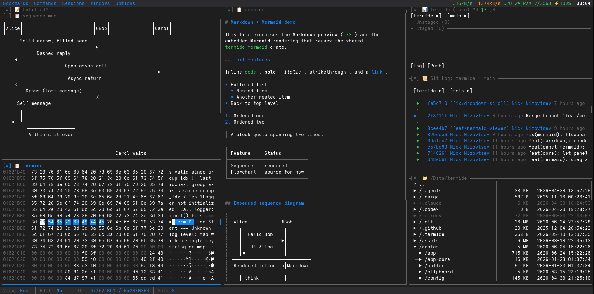

# TermIDE

[](https://github.com/termide/termide/releases)
[](https://github.com/termide/termide/actions)
[](https://opensource.org/licenses/MIT)

[English](README.md) | [中文](README.zh.md) | **Русский**

Терминальная IDE с нулевой настройкой, объединяющая редактор, файловый менеджер и терминал — со встроенными просмотрщиками git, баз данных, hex, Markdown, изображений и Mermaid — в одном кроссплатформенном TUI, написанном на Rust.

**[Сайт](https://termide.github.io)** | **[Документация](doc/ru/README.md)** | **[Релизы](https://github.com/termide/termide/releases)** | **[Скриншоты](https://ibb.co/album/nPX6p6)**

<p align="center"></p>

## Почему TermIDE?

В отличие от традиционных терминальных редакторов, требующих обширной настройки плагинов, TermIDE работает из коробки:

| Возможность | TermIDE | Vim/Neovim | Helix | Micro |
|---------|:-------:|:----------:|:-----:|:-----:|
| Нулевая настройка | ✓ | ✗ | ✓ | ✓ |
| Поддержка LSP | ✓ | плагин | ✓ | плагин |
| Автоматизация скриптами | ✓ | плагин | ✗ | плагин |
| Hex / бинарный просмотрщик | ✓ | плагин | ✗ | плагин |
| Просмотр баз данных | ✓ | плагин | ✗ | ✗ |
| Просмотр Markdown | ✓ | плагин | ✗ | ✗ |
| Просмотр диаграмм (Mermaid) | ✓ | плагин | ✗ | ✗ |
| Просмотр изображений | ✓ | плагин | ✗ | ✗ |
| Встроенный терминал | ✓ | плагин | ✗ | ✗ |
| Файловый менеджер | ✓ | плагин | ✗ | ✗ |
| Удалённые ФС (SFTP/FTP) | ✓ | плагин | ✗ | ✗ |
| Фоновые файловые операции | ✓ | плагин | ✗ | ✗ |
| Интеграция с Git | ✓ | плагин | ✗ | ✗ |
| Сессии | ✓ | плагин | ✗ | ✗ |
| Многопанельный интерфейс | ✓ | плагин | ✗ | ✗ |
| Закладки | ✓ | плагин | ✗ | ✗ |
| Локализация интерфейса | ✓ | ✗ | ✗ | ✗ |
| Монитор ресурсов | ✓ | ✗ | ✗ | ✗ |

**TermIDE = Редактор + Файловый менеджер + Терминал в одном TUI-приложении.**

## Возможности

- **Терминальная IDE** - Подсветка синтаксиса для 21 языка, навигация по словам (Ctrl+Left/Right), навигация по абзацам/символам (Ctrl+Up/Down), переключение комментариев (Ctrl+/), автоотступы, автозакрытие скобок
- **Поддержка LSP** - Автодополнение, поиск ссылок (Shift+F12), переименование символа (F4), переход к определению (Ctrl+Click), диагностика
- **Умный файловый менеджер** - Древовидный вид с разворачиваемыми каталогами, вложенный git-статус, пакетные операции, поиск по файлам/содержимому (glob/regex), инкрементальный поиск в дереве
- **Удалённые файловые системы** - Просмотр и редактирование файлов на удалённых серверах прямо из файлового менеджера по SFTP / FTP / FTPS, копирование между локальной и удалённой панелями — на чистом Rust (russh + rustls), без нативных библиотек, работает на статическом musl (`smb://` / `nfs://` — через системное монтирование)
- **Фоновые файловые операции** - Копирование, перемещение, загрузка, скачивание, удаление и пакетные передачи выполняются в фоне с прогресс-баром, счётчиком байт/времени и паузой / возобновлением / отменой (панель операций)
- **Встроенный терминал** - Полная поддержка PTY, escape-последовательности VT100, отслеживание мыши
- **Интеграция с Git** - Панель статуса, журнал коммитов с цветным Unicode-графом (откат к ASCII), индексация/деиндексация, переключение веток, управление stash, инлайн blame
- **Просмотр баз данных** - Браузер только для чтения для SQLite / PostgreSQL / MySQL, открываемый по URL-закладке: таблица с 2D-курсором по ячейкам, серверная сортировка по столбцу и типозависимая фильтрация по столбцам, постраничная подгрузка скользящим окном и диалог детали строки с копированием в TSV / JSON / INSERT
- **Многопанельный интерфейс** - Вертикально разделённые группы панелей с настраиваемой высотой каждой и переключением полноэкранного режима одной клавишей (`Alt+F11`); умное авто-стекирование при сужении терминала; новые панели открываются после активной
- **Просмотр изображений** - Нативная графика в терминалах Kitty, WezTerm, iTerm2, Ghostty, foot
- **Hex / бинарный просмотрщик и редактор** - Hex/ASCII-вид (адаптивные секции по 16 байт) для бинарных файлов, курсор байта показан в обеих зонах, выделение перетаскиванием/Shift и копирование в буфер, поиск по ASCII и hex-байтам, переключение hex↔текст (`Ctrl+L`); `F4` открывает для перезаписи с резервной копией `.bak` при сохранении
- **Просмотр Markdown** - Рендеренный просмотр (только чтение) для `.md` / `.markdown` (заголовки, списки, таблицы, подсвеченные блоки кода, кликабельные ссылки и пиктограммы изображений) с курсором, выделением и копированием; `Ctrl+E` переключает на редактируемый исходник; встроенные блоки ```mermaid``` рендерятся как диаграммы
- **Просмотр диаграмм Mermaid** - Рендер `.mmd` / `.mermaid` в текстовую псевдографику — flowchart, sequence, state, class, ER, gantt, pie, journey, mindmap, timeline, gitGraph, quadrant; 2D-прокрутка, копирование в буфер и `Ctrl+E` для редактирования исходника
- **Внешние приложения** - Открытие файлов системными приложениями по умолчанию (Shift+Enter)
- **39 встроенных тем** - Тёмные, светлые, ретро и кинематографичные темы (Dracula, Nord, Monokai, Solarized, Matrix, Pip-Boy, Norton Commander, Windows 95 и др.)
- **Пользовательские темы** - Создавайте свои темы в формате TOML
- **15 языков интерфейса** - Бенгальский, китайский, английский, французский, немецкий, хинди, индонезийский, японский, корейский, португальский, русский, испанский, тайский, турецкий, вьетнамский (отсутствующие ключи прозрачно откатываются к английскому)
- **Управление сессиями** - Автосохранение и восстановление раскладок панелей
- **Системный монитор** - CPU, RAM, сетевой I/O в реальном времени в меню-баре и использование диска в статус-баре; клик по индикатору открывает модал с деталями (топ процессов по CPU/RAM, топ по сетевым соединениям с прослушиваемыми портами); повторный клик закрывает модал
- **Поиск и замена** - Живой предпросмотр, счётчик совпадений, поддержка regex
- **Пользовательские скрипты** - Запуск своих скриптов из меню Scripts (поддержка `.bg.` для фона, `.report.` для прокручиваемого модального вывода с индикатором успеха/ошибки)
- **Модал настроек** - Полноэкранная конфигурация (`Alt+P`) с боковой раскладкой, сгруппированными полями (Внешний вид / Ввод / Раскладка / Производительность / …) и захватом клавиш на месте для 7 областей привязок
- **Кроссплатформенность** - Linux (x86_64, ARM64), macOS (Intel, Apple Silicon), Windows (нативно через ConPTY, WSL)
- **Полная поддержка мыши** - Навигация кликом, прокрутка, действия двойным кликом
- **Раскладки клавиатуры** - Поддержка кириллицы с автоматическим переводом горячих клавиш
- **Vim-режим** - Опциональное редактирование в стиле Vim с поддержкой кириллической раскладки
- **Переключатель каталогов** - Быстрая смена каталога по Ctrl+/
- **Закладки** - Сохранение и организация часто используемых мест
- **Палитра команд** - Быстрый доступ ко всем командам (Ctrl+P)

## Установка

**Быстрый старт:** Скачайте готовые бинарники с [GitHub Releases](https://github.com/termide/termide/releases) или установите через ваш пакетный менеджер.

**Поддерживаемые платформы:** Linux (x86_64, ARM64), macOS (Intel, Apple Silicon), Windows (x86_64)

### Выберите способ установки

<details open>
<summary><b>📦 Готовые бинарники (рекомендуется)</b></summary>

Скачайте последний релиз для вашей платформы с [GitHub Releases](https://github.com/termide/termide/releases):

```bash
# Linux x86_64 (также работает в WSL)
wget https://github.com/termide/termide/releases/latest/download/termide-0.27.0-x86_64-unknown-linux-gnu.tar.gz
tar xzf termide-0.27.0-x86_64-unknown-linux-gnu.tar.gz
./termide

# Linux x86_64 (статический musl — Alpine, distroless-контейнеры, любая система без glibc)
wget https://github.com/termide/termide/releases/latest/download/termide-0.27.0-x86_64-unknown-linux-musl.tar.gz
tar xzf termide-0.27.0-x86_64-unknown-linux-musl.tar.gz
./termide

# macOS Intel (x86_64)
curl -LO https://github.com/termide/termide/releases/latest/download/termide-0.27.0-x86_64-apple-darwin.tar.gz
tar xzf termide-0.27.0-x86_64-apple-darwin.tar.gz
./termide

# macOS Apple Silicon (ARM64)
curl -LO https://github.com/termide/termide/releases/latest/download/termide-0.27.0-aarch64-apple-darwin.tar.gz
tar xzf termide-0.27.0-aarch64-apple-darwin.tar.gz
./termide

# Linux ARM64 (Raspberry Pi, ARM-серверы)
wget https://github.com/termide/termide/releases/latest/download/termide-0.27.0-aarch64-unknown-linux-gnu.tar.gz
tar xzf termide-0.27.0-aarch64-unknown-linux-gnu.tar.gz
./termide

# Linux ARM64 (статический musl — Android/Termux, Alpine ARM, любой ARM64 без glibc)
wget https://github.com/termide/termide/releases/latest/download/termide-0.27.0-aarch64-unknown-linux-musl.tar.gz
tar xzf termide-0.27.0-aarch64-unknown-linux-musl.tar.gz
./termide

# Windows x86_64 (скачайте .zip с Releases, распакуйте, запустите в Windows Terminal)
# https://github.com/termide/termide/releases/latest/download/termide-0.27.0-x86_64-pc-windows-msvc.zip
```

</details>

<details>
<summary><b>🪟 Windows (.zip)</b></summary>

TermIDE работает нативно на Windows 10+ через ConPTY. Для лучшего опыта используйте **Windows Terminal**.

1. Скачайте `termide-0.27.0-x86_64-pc-windows-msvc.zip` с [GitHub Releases](https://github.com/termide/termide/releases).
2. Распакуйте архив.
3. Запустите `termide.exe` в Windows Terminal.

Конфигурация хранится в `%APPDATA%\termide\` (config, сессии) и
`%LOCALAPPDATA%\termide\cache\` (логи).

Либо в **WSL/WSL2** используйте сборку Linux x86_64 (`termide-0.27.0-x86_64-unknown-linux-gnu.tar.gz`), как на любом Linux.

</details>

<details>
<summary><b>🐧 Debian/Ubuntu (.deb)</b></summary>

Скачайте и установите пакет `.deb` с [GitHub Releases](https://github.com/termide/termide/releases):

```bash
# Только x86_64 (для ARM64 используйте tar.gz выше)
wget https://github.com/termide/termide/releases/latest/download/termide_0.27.0-1_amd64.deb
sudo dpkg -i termide_0.27.0-1_amd64.deb
```

</details>

<details>
<summary><b>🎩 Fedora/RHEL/CentOS (.rpm)</b></summary>

Скачайте и установите пакет `.rpm` с [GitHub Releases](https://github.com/termide/termide/releases):

```bash
# Только x86_64 (для ARM64 используйте tar.gz выше)
wget https://github.com/termide/termide/releases/latest/download/termide-0.27.0-1.x86_64.rpm
sudo rpm -i termide-0.27.0-1.x86_64.rpm
```

</details>

<details>
<summary><b>🐧 Arch Linux (AUR)</b></summary>

Установите из AUR любимым AUR-помощником:

```bash
# Сборка из исходников
yay -S termide

# Или готовый бинарник
yay -S termide-bin
```

Либо вручную:

```bash
git clone https://aur.archlinux.org/termide.git
cd termide
makepkg -si
```

</details>

<details>
<summary><b>🍺 Homebrew (macOS/Linux)</b></summary>

Установите через Homebrew tap:

```bash
brew tap termide/termide
brew install termide
```

</details>

<details>
<summary><b>❄️ NixOS/Nix (Flakes)</b></summary>

Установите через Nix flakes:

```bash
# Запуск без установки
nix run github:termide/termide

# Установка в профиль пользователя
nix profile install github:termide/termide

# Или добавьте в NixOS configuration.nix
{
  nixpkgs.overlays = [
    (import (builtins.fetchTarball "https://github.com/termide/termide/archive/main.tar.gz")).overlays.default
  ];
  environment.systemPackages = [ pkgs.termide ];
}
```

</details>

<details>
<summary><b>🤖 Android (Termux)</b></summary>

В [Termux](https://termux.dev) используйте сборку **статического ARM64 musl** (сборка glibc
`aarch64-unknown-linux-gnu` не работает на Bionic libc Android):

```bash
pkg install git openssh   # инструменты, которые вызывает termide (а также нужные LSP-серверы)
wget https://github.com/termide/termide/releases/latest/download/termide-0.27.0-aarch64-unknown-linux-musl.tar.gz
tar xzf termide-0.27.0-aarch64-unknown-linux-musl.tar.gz
./termide
```

Примечания: на Android нет системного буфера обмена (нет X11/Wayland), а монитор ресурсов
может показывать неполные данные из-за ограниченного `/proc`. Редактор, файловый менеджер,
git и встроенный терминал работают штатно.

</details>

<details>
<summary><b>🔨 Сборка из исходников (Cargo)</b></summary>

Сборка из исходников с помощью Cargo:

```bash
# Клонировать репозиторий
git clone https://github.com/termide/termide.git
cd termide

# Собрать и запустить
cargo run --release
```

</details>

<details>
<summary><b>🔨 Сборка из исходников (Nix)</b></summary>

Сборка из исходников с помощью Nix (для разработки):

```bash
# Клонировать репозиторий
git clone https://github.com/termide/termide.git
cd termide

# Войти в окружение разработки (включает Rust-тулчейн и все зависимости)
nix develop

# Собрать проект
cargo build --release

# Запустить
./target/release/termide
```

</details>

<details>
<summary><b>📦 Переносимый статический бинарник (Alpine / любой Linux)</b></summary>

С каждым релизом публикуется полностью статическая сборка musl. Она не линкует
разделяемых библиотек и работает на любом дистрибутиве Linux, включая Alpine и
минимальные контейнеры. Весь проект на чистом Rust (rustls + russh + russh-sftp —
без OpenSSL и libssh2), поэтому это тот же код, просто собранный под musl.

Проще всего взять готовый tarball из релиза:

```bash
wget https://github.com/termide/termide/releases/latest/download/termide-0.27.0-x86_64-unknown-linux-musl.tar.gz
tar xzf termide-0.27.0-x86_64-unknown-linux-musl.tar.gz
./termide

# Проверка полной статичности — нет разделяемых библиотек
ldd ./termide   # → "not a dynamic executable"
```

Если хотите собрать сами (например, под другой вариант musl), flake предоставляет
тот же рецепт как деривацию:

```bash
nix build github:termide/termide#termide-static
./result/bin/termide
```

Любой из бинарников можно скопировать куда угодно — в контейнер, урезанный образ
Alpine, embedded-устройство — и он будет работать без установленных musl-dev или glibc.

</details>

## Требования

- Для готовых бинарников: дополнительных требований нет
- Для сборки из исходников:
  - Rust 1.70+ (stable)
  - Для пользователей Nix: Nix с включёнными flakes

### Опции командной строки

```
termide [OPTIONS] [FILE]...

Аргументы:
  [FILE]...            Файл(ы) для открытия. С путём TermIDE стартует в чистом
                       редакторе (без восстановления/сохранения сессии), поэтому
                       работает как $EDITOR для git, crontab, visudo и т. д.

Опции:
  --log-level <LEVEL>  Уровень логирования (trace, debug, info, warn, error)
  --no-lsp             Отключить LSP-серверы
  --config <FILE>      Использовать свой путь к файлу конфигурации
  --diagnostics        Прогнать предполётную диагностику и выйти (без UI)
  -h, --help           Показать справку
  -V, --version        Показать версию
```

Использование в качестве редактора:

```sh
export EDITOR=termide   # git commit, crontab -e, visudo, ...
```

## Использование

### Быстрый старт

После запуска TermIDE вы увидите раскладку, адаптивную по ширине:
- **Широкие терминалы (>= 160 колонок):** Боковая панель (Git Status в стопке с Operations) + две панели файлового менеджера
- **Обычные терминалы (< 160 колонок):** Боковая панель (Git Status, файловый менеджер и Operations в стопке) + панель файлового менеджера
- Меню-бар сверху, статус-бар снизу

Панели в стопке делят колонку с настраиваемой высотой каждой. `Alt+F11` переключает пресет «полноэкранная текущая панель» (одна панель занимает всю высоту колонки, остальные сворачиваются в строку заголовка); `Ctrl+Alt+=` / `Ctrl+Alt+-` увеличивают / уменьшают фокусную панель на 3 строки.

Используйте `Alt+←/→` для переключения групп панелей, `Alt+↑/↓` для навигации внутри группы, `Alt+M` для открытия меню.

### Документация

Подробная документация:
- **Английский**: [doc/en/README.md](doc/en/README.md)
- **Русский**: [doc/ru/README.md](doc/ru/README.md)
- **Китайский**: [doc/zh/README.md](doc/zh/README.md)

### Горячие клавиши

Все клавиши настраиваются в `config.toml` (см. [Конфигурация](#конфигурация)). Основное:

- **Навигация:** `Alt+M` меню · `Alt+H` помощь · `Alt+Q` выход · `Ctrl+P` палитра команд
- **Панели:** `Alt+←/→` и `Alt+↑/↓` перемещение между/внутри групп · `Alt+1-9` переход к панели · `Alt+K` меню действий панели
- **Открыть:** `Alt+F` Файлы · `Alt+T` Терминал · `Alt+E` Редактор · `Alt+G` Git · `Alt+P` Настройки
- **Файлы и просмотрщики:** `F3` предпросмотр (markdown / диаграмма / hex / изображение) · `Ctrl+E` переключение предпросмотр ↔ исходник · `Ctrl+F` поиск · `Ctrl+R` перечитать с диска · `Ctrl+S` сохранить

📖 Полный справочник по панелям (файловый менеджер, редактор, git, просмотрщики): **[doc/ru/keybindings.md](doc/ru/keybindings.md)**.

## Конфигурация

TermIDE следует [спецификации XDG Base Directory](https://specifications.freedesktop.org/basedir-spec/basedir-spec-latest.html) для организации файлов.

**Расположение файла конфигурации:**
- Linux/BSD: `~/.config/termide/config.toml` (или `$XDG_CONFIG_HOME/termide/config.toml`)
- macOS: `~/Library/Application Support/termide/config.toml`
- Windows: `%APPDATA%\termide\config.toml`

**Расположение данных сессий:**
- Linux/BSD: `~/.local/share/termide/sessions/` (или `$XDG_DATA_HOME/termide/sessions/`)
- macOS: `~/Library/Application Support/termide/sessions/`
- Windows: `%APPDATA%\termide\sessions\`

**Расположение файла логов:**
- Linux/BSD: `~/.cache/termide/termide.log` (или `$XDG_CACHE_HOME/termide/termide.log`)
- macOS: `~/Library/Caches/termide/termide.log`
- Windows: `%LOCALAPPDATA%\termide\cache\termide.log`

**Расположение закладок:**
- Linux/BSD: `~/.local/share/termide/bookmarks.toml` (или `$XDG_DATA_HOME/termide/bookmarks.toml`)
- macOS: `~/Library/Application Support/termide/bookmarks.toml`

### Пример конфигурации

```toml
[general]
theme = "windows-xp"
language = "auto"  # auto, bn, de, en, es, fr, hi, id, ja, ko, pt, ru, th, tr, vi, zh
vim_mode = false
session_retention_days = 30
bell_on_operation_complete = true
icon_mode = "auto"  # auto, emoji, unicode
resource_monitor_interval = 1000

[editor]
tab_size = 4
show_git_diff = true
word_wrap = true
auto_indent = true
auto_close_brackets = true

[file_manager]
extended_view_width = 50

[lsp]
enabled = true
auto_completion = true

[logging]
min_level = "info"
```

### Доступные темы

**Тёмные темы:**
- `windows-xp` - Тема по умолчанию (в стиле Windows XP)
- `dracula` - Популярная тема Dracula
- `monokai` - Классическая Monokai
- `nord` - Nord с синими тонами
- `onedark` - Atom One Dark
- `solarized-dark` - Тёмная Solarized
- `midnight` - Вдохновлено Midnight Commander
- `macos-dark` - Тёмный стиль macOS
- `ayu-dark` - Ayu Dark
- `billiard` - Зелёные тона бильярдного стола
- `catppuccin-macchiato` - Catppuccin Macchiato
- `everforest` - Тёмная Everforest
- `github-dark` - GitHub Dark
- `gruvbox` - Тёмная Gruvbox
- `kanagawa` - Kanagawa
- `material-ocean` - Material Ocean
- `rosepine` - Rosé Pine
- `tokyonight` - Tokyo Night

**Светлые темы:**
- `atom-one-light` - Atom One Light
- `ayu-light` - Ayu Light
- `github-light` - GitHub Light
- `manuscript` - Средневековый манускрипт в тонах состаренного пергамента
- `material-lighter` - Material Lighter
- `solarized-light` - Светлая Solarized
- `macos-light` - Светлый стиль macOS
- `blue-sky` - Blue Sky
- `green-backs` - Зелёные доллары
- `pinky-pie` - Pinky Pie

**Ретро-темы:**
- `far-manager` - Стиль FAR Manager
- `norton-commander` - Стиль Norton Commander
- `dos-navigator` - Стиль DOS Navigator
- `volkov-commander` - Стиль Volkov Commander
- `windows-95` - Стиль Windows 95
- `windows-98` - Стиль Windows 98

**Кинематографичные темы:**
- `matrix` - Цифровой дождь из «Матрицы» (зелёное на чёрном)
- `pip-boy` - Фосфорный CRT Pip-Boy 3000 из Fallout
- `terminator` - Эстетика HUD Skynet / марсианского красного

**Прочие темы:**
- `terminal` - Классический терминальный стиль (наследует цвета терминала)

**Примеры тем:**

| | | |
|:---:|:---:|:---:|
|  |  |  |
| Windows XP (по умолчанию) | Dracula | Ayu Light |
|  |  |  |
| Monokai | Nord | Material Lighter |

### Пользовательские темы

Свои темы создаются размещением TOML-файлов в каталоге тем:
- Linux: `~/.config/termide/themes/`
- macOS: `~/Library/Application Support/termide/themes/`
- Windows: `%APPDATA%\termide\themes\`

Пользовательские темы имеют приоритет над встроенными с тем же именем. Примеры формата файла темы — в каталоге `crates/theme/themes/` репозитория.

### Пользовательские скрипты

Свои скрипты можно добавить в меню Scripts, поместив исполняемые файлы в:
- Linux: `~/.local/share/termide/scripts/`
- macOS: `~/Library/Application Support/termide/scripts/`
- Windows: `%APPDATA%\termide\scripts\`

**Возможности:**
- Скрипты появляются в меню Scripts (меню-бар)
- Подкаталоги создают вложенные подменю (клик по группе сворачивает/разворачивает её)
- Добавьте `.bg.` в имя файла для фонового запуска (например, `deploy.bg.sh`)
- Добавьте `.report.` в имя файла для фона с модальным выводом (например, `check.report.sh`). Модал отчёта прокручивается (Up/Down, PageUp/PageDown, Home/End, колесо мыши) и показывает ✓/✗ в заголовке
- Отображаемое имя — это часть до первой точки

**Пример:**
```bash
# Создать каталог скриптов
mkdir -p ~/.local/share/termide/scripts

# Добавить простой скрипт
cat > ~/.local/share/termide/scripts/hello.sh << 'EOF'
#!/bin/bash
echo "Hello from TermIDE!"
read -p "Press Enter to close..."
EOF

# Сделать исполняемым (обязательно на Unix)
chmod +x ~/.local/share/termide/scripts/hello.sh
```

**Примечание:** На Unix-системах скрипты должны иметь право на исполнение (`chmod +x`). Используйте `Options → Manage scripts`, чтобы открыть папку скриптов.

## Разработка

Кодовая база — это Cargo workspace из модульных крейтов. Раскладку крейтов,
систему панелей и поток событий см. в
**[Руководстве разработчика](doc/ru/developer-guide.md)** и
**[Архитектуре](doc/ru/architecture.md)**.

### Сборка

```bash
# Отладочная сборка
cargo build

# Релизная сборка с оптимизациями
cargo build --release

# Запуск тестов
cargo test

# Проверка качества кода
cargo clippy
cargo fmt --check
```

### Разработка с Nix

В проекте есть Nix flake для воспроизводимых окружений разработки:

```bash
# Войти в shell разработки
nix develop

# Сборка через Nix
nix build

# Запуск проверок
nix flake check
```

## Вклад

Вклад приветствуется! Не стесняйтесь открывать issue и pull request'ы.

## Лицензия

Проект распространяется под лицензией MIT.

## Благодарности

Построено на:
- [ratatui](https://github.com/ratatui-org/ratatui) - Фреймворк терминального UI
- [crossterm](https://github.com/crossterm-rs/crossterm) - Кроссплатформенная работа с терминалом
- [portable-pty](https://github.com/wez/wezterm/tree/main/pty) - Реализация PTY
- [tree-sitter](https://github.com/tree-sitter/tree-sitter) - Подсветка синтаксиса
- [ropey](https://github.com/cessen/ropey) - Текстовый буфер
- [sysinfo](https://github.com/GuillaumeGomez/sysinfo) - Мониторинг системных ресурсов
